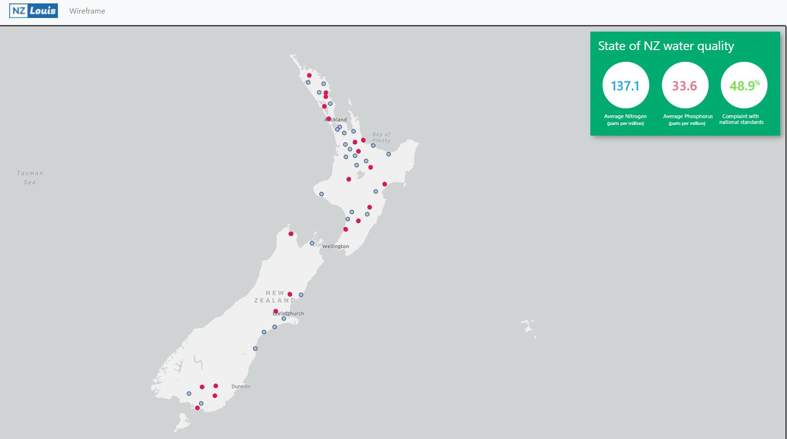

# react-arcgis-wireframe

This is an online map system to build the basic wire-frame for showing the state of New Zealand water quality, implemented using react and Arcgis (**[Esri JS API](https://developers.arcgis.com/javascript/latest/api-reference/index.html)**). Contains functions such as wire-frame. The system uses many reusable components to improve the reusability of the project.

## Getting started

To get the frontend running locally:

- Clone this repo
- `npm install` to install all req'd dependencies
- `npm start` to start the local server (this project uses create-react-app)
- `npm test` to start the local testing
